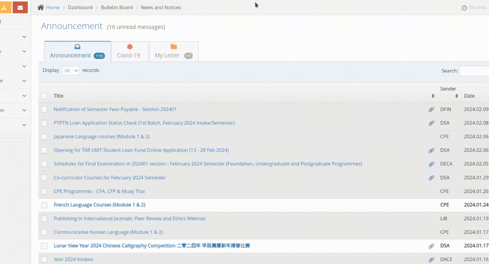
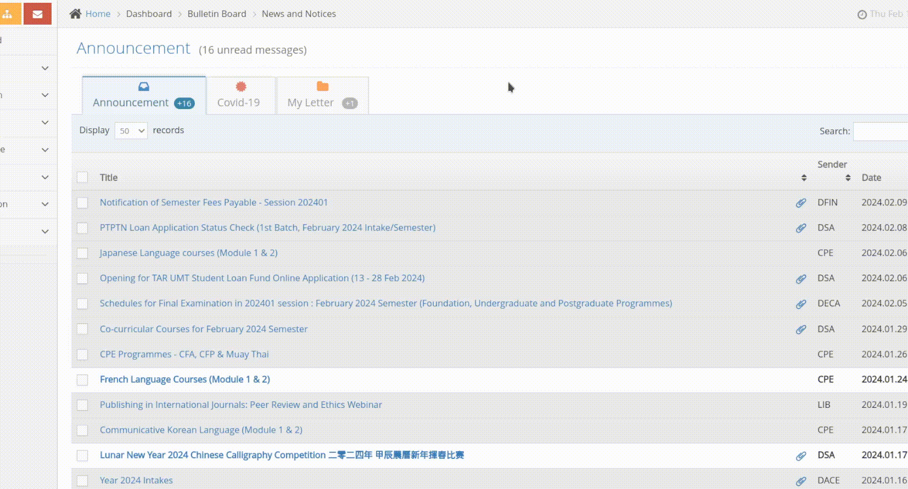

TARUMT Intranet Session Refresher
=================================

A **Chrome extension** to save you clicks ~~and annoyance~~ from logging in again after the session has expired.

---

#### Without extension



#### With extension



Supported Sites
---------------

- https://web.tarc.edu.my/portal
- https://reg.tarc.edu.my/portal

Installation
------------

### Before installing

⚠️ This extension stores password as plaintext in local storage and is vulnerable to credentials stealer. Exercise caution and change your password if you have run any malicious programs or extensions.

Because of limitations, it is stored in local storage. If you have any suggestions feel free to [open an issue](https://github.com/makan-kencing/tarumt-intranet-session-refresher/issues/new) or [pull request](https://github.com/makan-kencing/tarumt-intranet-session-refresher/compare).

Related stack overflow https://stackoverflow.com/questions/17280390/can-local-storage-ever-be-considered-secure.

---

### From packed (Linux only)

Install the latest .crx from [release](https://github.com/makan-kencing/tarumt-intranet-session-refresher/releases/latest) and drag it into Chrome to install.

### From source code

1. Install the latest source code from [release](https://github.com/makan-kencing/tarumt-intranet-session-refresher/releases/latest) in .zip (or any format that you can extract), and extract it into a folder.
2. Navigate to `chrome://extensions/` in Chrome.
   - Make sure `Developer mode` is enabled. <sup>(top right corner)</sup>
3. Click `Load unpacked` and select the folder with the source code.

Usage
-----

1. [Install](#installation) and enable the extension.
2. Click on the extension icon <sup>(beside url bar)</sup> and click `Intranet Session Refresher` to open the menu.
3. Fill in the username and password.
4. Save and done!

Developing
----------

- Have git

1. Clone the repository.
   ```shell
   git clone https://github.com/makan-kencing/tarumt-intranet-session-refresher.git
   ```
2. Install the extension [from source](#from-source-code).

Implementation
--------------

- The extension inject a script to check if the page is redirecting to expired session.
- When found, the page is blocked from redirecting.
- Session is refreshed using the provided username and password.
- Page is then refreshed.
  - If the login is unsuccessful, it will then be normally redirected to the correct expired session page.

Ending notes<i>?</i>
--------------------

This extension is NOT affiliated with Tunku Abdul Rahman University of Management and Technology (TARUMT) or any similar entities.
